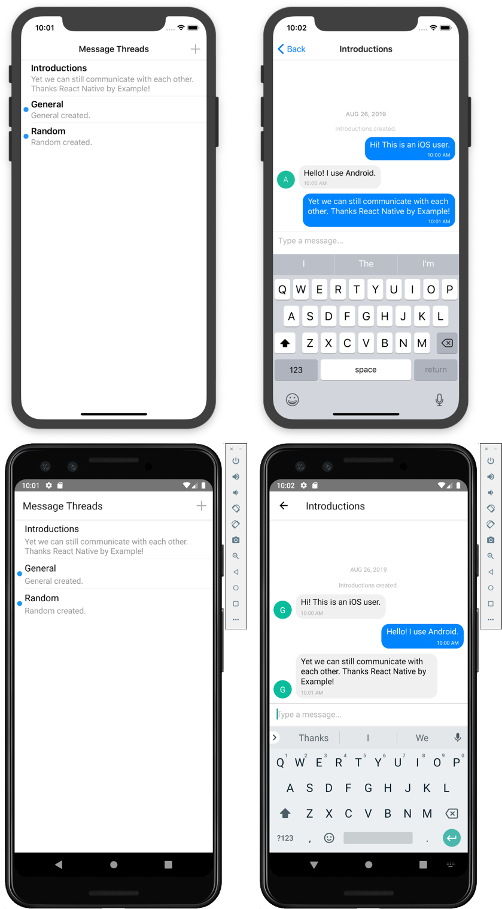

## React Native Firebase Chat App

A simple cross platform (iOS and Android) React Native anonymous chat app. This example was put together for [React Native School](https://www.reactnativeschool.com/build-a-chat-app/). Get started learning & mastering React Native for free!

### Installation

> **Note:** Be sure you have the React Native CLI [installed on your system](https://facebook.github.io/react-native/docs/getting-started).

- `git clone https://github.com/ReactNativeSchool/react-native-firebase-chat-app.git`
- `yarn install`/`npm install`
- `npx pod-install ios`

### Running

- `yarn run ios`/`npm run ios` or `yarn run android`/`npm run android`

---

This project was put together to serve as an example to help you in building your own React Native apps. Feel free to download it and tinker with it!

Curious how it was built? I'll [walk you through it step-by-step](https://www.reactnativeschool.com/build-a-chat-app/).
